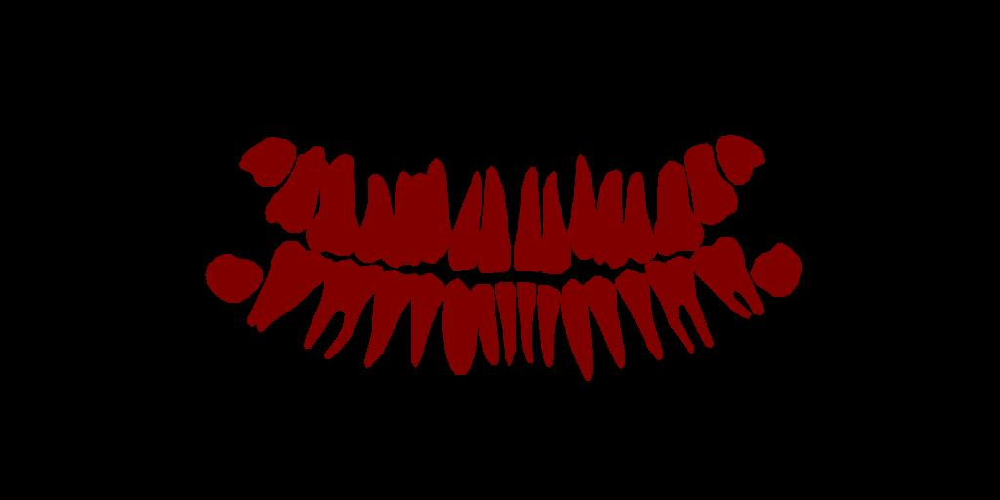
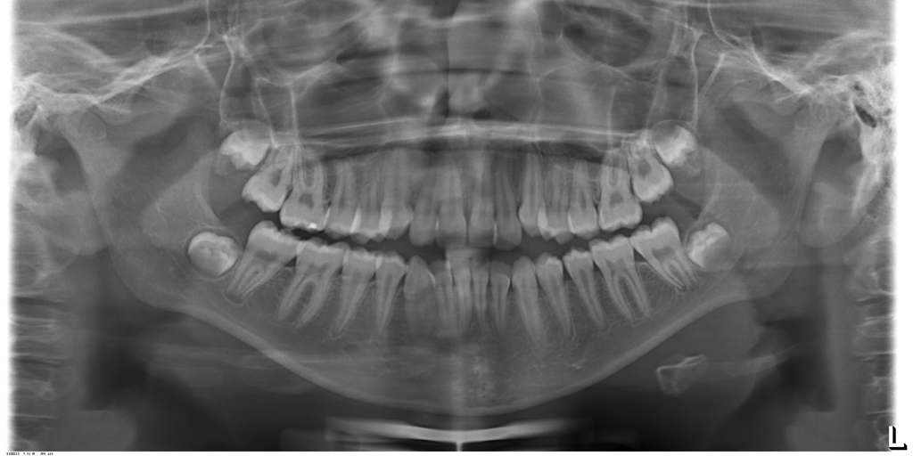

# pix2pixHDv2

pix2pixHDv2 is a modernization of NVIDIA's pix2pixHD framework for efficient
panoramic dental image synthesis. The project accompanies the manuscript
**"pix2pixHDv2: Efficient Panoramic Dental Image Synthesis with Minimal
Artifacts and Computational Overhead"** and keeps the original pix2pixHD
training and inference workflow while adding lightweight generator variants.

This repository is intended as a research code release. It does not include
datasets, trained weights, or private experiment artifacts.

## Overview

The original pix2pixHD model is a strong baseline for high-resolution
image-to-image translation. pix2pixHDv2 keeps the same overall interface and
data pipeline, but modernizes the generator with optional upsampling and
residual-block alternatives intended to reduce artifacts and computational
overhead.

The supported generator options are:

| Argument | Values |
| --- | --- |
| `--netG` | `global`, `global_upsample`, `global_pixelshuffle`, `global_espcn` |
| `--g1_residual` | `resnet`, `convnext`, `convnextv2` |

All other major training and testing conventions follow the original
NVIDIA/pix2pixHD repository.

## Example

The following documentation example shows a segmentation-style dental mask and
its corresponding panoramic dental image.

| Input mask | Reference image |
| --- | --- |
|  |  |

## Installation

Install PyTorch for your CUDA/runtime environment from the official PyTorch
instructions, then install the small Python dependencies used by pix2pixHD:

```bash
pip install dominate pillow numpy
```

PyTorch installation guide:

```text
https://pytorch.org/get-started/locally/
```

## Dataset Layout

For semantic-mask-to-image synthesis, prepare the dataset with the same folder
structure used by pix2pixHD:

```text
datasets/
  your_dataset/
    train_label/
      0001.png
      0002.png
      ...
    train_img/
      0001.png
      0002.png
      ...
    test_label/
      0001.png
      0002.png
      ...
    test_img/
      0001.png
      0002.png
      ...
```

The filenames in `*_label` and `*_img` should correspond to the same cases.
Label images should be single-channel semantic masks where pixel values encode
class IDs. For a binary dental mask setup, use:

```bash
--label_nc 2 --no_instance
```

## Training

Example training command:

```bash
python train.py ^
  --dataroot ./datasets/your_dataset ^
  --checkpoints_dir ./checkpoints ^
  --name pix2pixHDv2_dental ^
  --netG global_upsample ^
  --g1_residual convnext ^
  --label_nc 2 ^
  --no_instance ^
  --loadSize 1024 ^
  --fineSize 1024 ^
  --resize_or_crop scale_width_and_crop ^
  --niter 100 ^
  --niter_decay 100 ^
  --save_epoch_freq 1
```

To try another model variant, change `--netG` and `--g1_residual`. For example:

```bash
--netG global_pixelshuffle --g1_residual convnextv2
```

The rest of the optimization, logging, and data-loading options are inherited
from pix2pixHD.

## Testing

Run inference with the same experiment name and architecture flags used during
training:

```bash
python test.py ^
  --dataroot ./datasets/your_dataset ^
  --checkpoints_dir ./checkpoints ^
  --name pix2pixHDv2_dental ^
  --netG global_upsample ^
  --g1_residual convnext ^
  --label_nc 2 ^
  --no_instance ^
  --loadSize 1024 ^
  --fineSize 1024 ^
  --resize_or_crop scale_width_and_crop ^
  --which_epoch latest ^
  --phase test ^
  --how_many 100 ^
  --results_dir ./results
```

The generated HTML report is written to:

```text
results/<experiment_name>/<phase>_<epoch>/index.html
```

## Notes for pix2pixHD Users

- Dataset organization, semantic label handling, instance-map options, training
  logs, and HTML result export follow NVIDIA/pix2pixHD.
- Use `--no_instance` when your dataset does not provide instance maps.
- Use `--label_nc N` for semantic masks with `N` classes.
- Keep `--name`, `--netG`, and `--g1_residual` consistent between training and
  testing.

## Original pix2pixHD

This project is derived from NVIDIA pix2pixHD:

- Original repository: https://github.com/NVIDIA/pix2pixHD
- Project page: https://tcwang0509.github.io/pix2pixHD/
- Paper: High-Resolution Image Synthesis and Semantic Manipulation with Conditional GANs, CVPR 2018

The original pix2pixHD code is distributed under a BSD license. The license text
is preserved in `LICENSE.txt`, including the notice for the
`pytorch-CycleGAN-and-pix2pix` project that pix2pixHD builds on.

If you use pix2pixHDv2, please also cite the original pix2pixHD paper:

```bibtex
@inproceedings{wang2018pix2pixHD,
  title={High-Resolution Image Synthesis and Semantic Manipulation with Conditional GANs},
  author={Ting-Chun Wang and Ming-Yu Liu and Jun-Yan Zhu and Andrew Tao and Jan Kautz and Bryan Catanzaro},
  booktitle={Proceedings of the IEEE Conference on Computer Vision and Pattern Recognition},
  year={2018}
}
```

## Citation

The citation entry for pix2pixHDv2 will be added after publication.

```bibtex
@article{pix2pixHDv2,
  title   = {pix2pixHDv2: Efficient Panoramic Dental Image Synthesis with Minimal Artifacts and Computational Overhead},
  author  = {To be added},
  journal = {To be added},
  year    = {To be added}
}
```
